# MCP Demo

A demonstration of the **Model Context Protocol (MCP)** using Claude as the AI backbone. This project connects Claude to a PostgreSQL database and an email reporter through custom MCP servers, enabling natural language queries and automated report delivery.

## Architecture

### Claude Desktop

```mermaid
flowchart TD
    CD["☁️ Claude Desktop"]
    AI["🤖 Claude AI"]

    subgraph mcp-postgres["mcp-postgres (MCP Server)"]
        PG_TOOLS["9 tools\nget_all_products · get_all_orders\nget_low_stock · get_orders_summary\n..."]
    end

    subgraph mcp-reporter["mcp-reporter (MCP Server)"]
        RP_TOOLS["1 tool\nsend_report(subject, body, to_email)"]
    end

    DB[("🐘 PostgreSQL\nproducts / orders")]
    GM["📧 Gmail SMTP"]

    CD --> AI
    AI -->|"MCP (stdio)"| mcp-postgres
    AI -->|"MCP (stdio)"| mcp-reporter
    mcp-postgres -->|SQL| DB
    mcp-reporter -->|SMTP| GM
```



### mcp-client (CLI)

```mermaid
flowchart TD
    U["👤 User"]
    MC["💻 mcp-client (CLI)"]
    CA["🤖 Claude API\nclaude-opus-4-6"]

    subgraph mcp-postgres["mcp-postgres (MCP Server)"]
        PG_TOOLS["PostgreSQL tools"]
    end

    subgraph mcp-reporter["mcp-reporter (MCP Server)"]
        RP_TOOLS["Email tools"]
    end

    DB[("🐘 PostgreSQL")]
    GM["📧 Gmail SMTP"]

    U -->|prompt| MC
    MC --> CA
    CA -->|"MCP (stdio)"| mcp-postgres
    CA -->|"MCP (stdio)"| mcp-reporter
    mcp-postgres -->|SQL| DB
    mcp-reporter -->|SMTP| GM
```



### Project Layout

```
mcp-demo/
├── servers/
│   ├── mcp-postgres/     MCP server — products & orders tools
│   └── mcp-reporter/     MCP server — email report sender
└── clients/
    └── mcp-client/       Interactive CLI powered by Claude
```

## Servers

| Server | Description | Tools |
|---|---|---|
| `mcp-postgres` | Query products & orders from PostgreSQL | 8 tools |
| `mcp-reporter` | Send HTML email reports via Gmail | 1 tool |

## Clients

| Client | Description |
|---|---|
| `mcp-client` | Interactive terminal chat backed by Claude |

## Prerequisites

- Python 3.11+
- [uv](https://docs.astral.sh/uv/) package manager
- PostgreSQL running locally
- Gmail account with an App Password

## Quick Start

**1. Set up each project's `.env`** (copy from `.env.example`):
```bash
cp servers/mcp-postgres/.env.example  servers/mcp-postgres/.env
cp servers/mcp-reporter/.env.example  servers/mcp-reporter/.env
cp clients/mcp-client/.env.example    clients/mcp-client/.env
```

**2. Fill in credentials** in each `.env` file.

**3. Run the client:**
```bash
cd clients/mcp-client
uv run main.py
```

**4. Chat naturally:**
```
You: Show me all pending orders
You: Which products are low on stock?
You: Send an orders summary report to my email
```

## Claude Desktop Integration

Add to `~/Library/Application Support/Claude/claude_desktop_config.json`:

```json
{
  "mcpServers": {
    "postgres-server": {
      "command": "uv",
      "args": ["--directory", "/path/to/mcp-demo/servers/mcp-postgres", "run", "main.py"]
    },
    "mcp-reporter": {
      "command": "uv",
      "args": ["--directory", "/path/to/mcp-demo/servers/mcp-reporter", "run", "main.py"]
    }
  }
}
```
